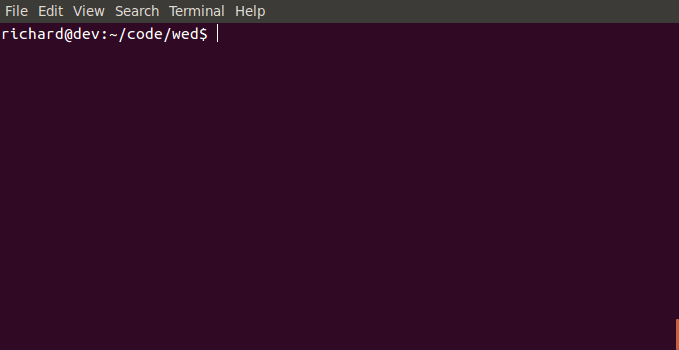

# wed - Windows terminal EDitor [](https://travis-ci.org/rgburke/wed)

## Introduction

Wed is a terminal text editor with key bindings commonly used in Windows based
editors. It aims for ease of use and to be a good starting editor for those new
to a Unix terminal environment. Using standard Windows editor key bindings
(e.g. `<C-c>` is copy, `<C-s>` is save) avoids the need to learn a new set
of key bindings whilst also takes advantage of existing muscle memory. For the
most basic tasks reading wed documentation should be unnecessary.

## Summary Of Core Features

 - Multiple files open in tabbed layout
 - Find & Replace (using PCRE and back references)
 - Text selection, copy/cut & paste
 - Syntax Highlighting
 - Themes to customise display colours
 - Supports Unix and Windows line endings
 - Unlimited undo & redo
 - Configurable using config files and runtime config commands
 - Gap buffer used as underlying storage structure

## Demo



## Quick Start

The following libraries and tools are required to build wed:

  - ncursesw
  - PCRE
  - Flex
  - Bison
  - GNU make
  - realpath (for running tests)

When using Source-highlight for syntax highlighting (enabled by default) the
following libraries are also required:

  - Source-highlight
  - Boost Regex

To build and install wed (defaults to `/usr/local/`) simply run:

```
make
sudo make install
```

To customise the build and installation edit `config.mk` or pass in the
relevant arguments. For example to build wed using clang and then install to
`/opt` run:

```
make CC=clang CXX=clang++ PREFIX=/opt
sudo make install PREFIX=/opt
```

To uninstall wed run `sudo make uninstall`.

As of 7060788 (9/Feb/2016) wed builds successfully without any compilation
warnings using the latest packages available on the following systems:

 - Ubuntu 15.10 and 12.04.5 LTS
 - FreeBSD 10.2
 - Cygwin 2.4.1

Wed should build and run on any \*nix system, although changes may be required
to `config.mk` in order to do so.

For a quick overview of functionality read the [Key Bindings](#key-bindings)
and [Config Variables](#config-variables) sections below.

### Motivation

The inspiration for wed came from watching a colleague attempt to use vim.
This person was quite competent when using a Windows based editor or IDE and
rarely needed to use the mouse. However they had only occasional need to use a
terminal environment and thus had a rudimentary understanding of vim. Watching
them delete 5 lines by pressing d 10 times or moving to the end of a line by
holding down the right directional key was enough to convince me they would be
much better suited by another editor.

Had this person been using a terminal editor with Windows like key bindings
they would have been quite proficient. It seemed clear then that an editor
with a display, feature set and key bindings similar to notepad++ for example,
would provide a way for many people unfamiliar with Unix editing tools to be
proficient very quickly.

Thus the idea for wed was born.

## Features

The main features of wed are detailed below.

### Key Bindings

The current wed key bindings are listed below. Vim key notation is used i.e.
the Control, Meta and Shift modifiers are represented by C, M and S
respectively. For example `<C-a>` is Ctrl-a and `<M-C-s>` on a PC is
Alt-Ctrl-s.

Although efforts have been taken to match the key bindings commonly used in
software such as notepad++, it has not been possible in all cases.
The default GNOME Terminal that ships with Ubuntu 15.10 has been used for
testing which key bindings can be detected by wed. Consequently certain key
combinations such as `C-Tab` and `<S-C-s>` cannot be detected in this
environment (and this is true for Xterm as well). Therefore in some cases the
key bindings wed uses differ from what would be expected.

Further to this some actions listed below can be achieved with multiple key
combinations for convenience and to avoid conflicting with other programs such
as window managers.

#### Movement

```
<Up>                        Move up a (screen) line
<Down>                      Move down a (screen) line
<Right>                     Move right one character
<Left>                      Move left one character
<Home>                      Move to start of (screen) line
<M-Home>                    Move to start of line
<End>                       Move to end of (screen) line
<M-End>                     Move to end of line
<C-Right>                   Move to next word
<C-Left>                    Move to previous work
<PageUp>                    Move up a page
<PageDown>                  Move down a page
<C-Home>                    Move to start of file
<C-End>                     Move to end of file
<C-g>                       Goto line
<C-b>                       Move to matching bracket
```

All movement keys apart from `<C-g>` and `<C-b>` can be combined with the
shift key to select text.

When line wrap is enabled (it is by default) a single line can wrap and take
up several lines on the screen, which are called screen lines. Some 
key bindings, those with "(screen)", operate on either lines or screen lines
depending on whether line wrap is disabled or enabled.

#### Text Manipulation

```
<Tab>                       Indent selected text
<S-Tab>                     Unindent selected text
<C-Delete>                  Delete next word
<M-Backspace>               Delete previous word
<C-a>                       Select all text
<C-c>                       Copy selected text
<C-x>                       Cut selected text
<C-v>                       Paste text
<C-z>                       Undo
<C-y>                       Redo
<C-S-Up>                    Move current line (or selected lines) up
<C-S-Down>                  Move current line (or selected lines) down
<C-d>                       Duplicate current line (or selected lines)
<C-j>                       Join (selected) lines
```

#### General

```
<C-s>                       Save
<M-C-s>                     Save as
<C-^>                       Save all
<C-f>                       Find
<F3>                        Find next
<S-F3>                      Find previous
<C-h> or <C-r>              Replace
<C-o>                       Open file
<C-n>                       New
<C-w>                       Close file
<M-C-Right> or <M-Right>    Next tab
<M-C-Left> or <M-Left>      Previous tab
<C-_>                       Change file
<C-\>                       Run wed command
<M-z>                       Suspend
<Escape> or <M-c>           Exit
```

#### Prompt

Some of the above key combinations such as "Find" or "Open file" will open a
prompt for input. The following key bindings can be used in any prompt.

```
<Up>                        Previous prompt entry
<Down>                      Subsequent prompt entry
<Escape>                    Quit prompt
```

The "Open file", "Save", "Save as" and "Change file" prompts all support
completion. For example, in the "Open file" prompt entering /o and then
`<Tab>` will complete the prompt text to /opt/. If there are multiple matching
directories/files they can be cycled through by entering `<Tab>` again.

```
<Tab>                       Complete entered text, then cycle through
                            suggestions on subsequent presses.
<S-Tab>                     Complete entered text, then cycle through
                            suggestions in reverse on subsequent presses.
```

Search options in wed can be configured in the find prompt by using the
key bindings below. The prompt text will list any options that deviate from
their default values.

```
<C-t>                       Toggle search type between Text and Regex
<C-s>                       Toggle case sensitivity
<C-d>                       Toggle search direction
```

### Config

Various aspects of wed's behaviour and appearance can be customised through
config specified in files or at runtime in the command prompt.

#### Config Variables

Config variables are used to enable, disable and configure features in wed.
During initialisation wed will attempt to load `/etc/wedrc` followed by 
`~/.wedrc`. Variables can be specified in either file with those in the former
applying to all users and those in the latter to the user running wed.

Any variables specified in these files act on a Global level. That is, they
will apply to all files opened by wed. File specific config can be applied
at run time by opening the "wed command" prompt and entering in a variable
assignment expression.

Variable assignment is done using the syntax `variable=value;` with any
white space ignored. The semicolon is optional if each assignment is done on a
single separate line. All text after a `#` is ignored as a comment. The
different type's are:

```
Type       | Pattern
-----------|-------------------------
bool       | true|false|1|0
int        | (-|\+)?\d+
string     | "(\\.|[^\\"])+"
regex      | \/(\\\/|[^\/])*\/[imsx]*
```

If a string contains no spaces, reserved characters or escaped characters
(e.g. `\n`), i.e. it matches the pattern `[^=;{}[:space:][:^print:]]+`, then
it can be specified without quotes. For example:

```
filetype = "perl"
```

and

```
filetype = perl
```
are equivalent.

The table below lists the variables available in wed and their properties:

```
Name          | Short | Level       | Type   | Default Val | Description
--------------|-------|-------------|--------|-------------|---------------------------------------------------------
linewrap      | lw    | Global/File | bool   | true        | Enables/Disables line wrap
lineno        | ln    | Global/File | bool   | true        | Enables/Disables line numbers
tabwidth      | tw    | Global/File | int    | 8           | Sets tab character screen width (allowed 1 - 8)
expandtab     | et    | Global/File | bool   | false       | Enables/Disables expanding tab characters into spaces
autoindent    | ai    | Global/File | bool   | true        | Enables/Disables autoindent
wedruntime    | wrt   | Global      | string | WEDRUNTIME  | Config definition location directory (set in config.mk)
syntax        | sy    | Global      | bool   | true        | Enables/Disables syntax highlighting
theme         | th    | Global      | string | "default"   | Set the active theme
syntaxdeftype | sdt   | Global      | string | "sh"        | Syntax definition type to use (allowed "sh" or "wed")
shdatadir     | shdd  | Global      | string | ""          | Directory path containing language definition files
filetype      | ft    | File        | string | ""          | Sets the type of the current file (drives syntaxtype)
syntaxtype    | st    | File        | string | ""          | Set the syntax definition to use for highlighting
fileformat    | ff    | File        | string | "unix"      | Sets line endings used by file (allowed "dos" or "unix")
```

An example of a `~/.wedrc` could be:

```
wedruntime = /opt/share/wed    # wed shared files were moved to /opt
tabwidth = 4                   # Tabs use 4 spaces when displayed
expandtab = true               # Tabs are expanded to spaces
autoindent = true              # New lines are indented based off previous line
```

Or equivalently: `wrt=/opt/share/wed;tw=4;et=1;ai=1;`.

To enable tabs again in only the current buffer enter `<C-\>et=0;<Enter>`
i.e. open up the wed command prompt and set `expandtab=false;`. This is
possible as `expandtab` applies at both the Global and File levels. Adding
`ff="dos";` to `~/.wedrc` for example would result in an error, as the
`fileformat` variable is only available at the File level and not the Global
level.

Global only variables can be set in the wed command prompt (e.g. theme) as
there is no ambiguity regarding the level they apply at.

#### Config Definitions

Config definitions allow objects to be defined which can be referenced by
config variables. There are currently three types of objects which can be
defined: `filetype`, `syntax` and `theme` all of which are examined in more
detail in the following sections.

These definitions are stored in the `WEDRUNTIME` directory, but can be
overwritten by placing config under `~/.wed/`.

##### Filetype Definition

A filetype defines a type of file and supplies a file path pattern that can
be used to identify files of its type. An example of a filetype is shown below:

```
filetype {
    name = "c";
    display_name = "C Source";
    file_pattern = /\.(c|h)$/;
}
```

Where `name` is the unique id of the filetype, `display_name` is a human
readable filetype name and `file_pattern` is a regex which can be applied to
a file path (absolute path or file name depending if the file exists) to
determine if a file matches this filetype.

When wed load's a file, it loops through each filetype and applies the
`file_pattern` regex to the files path allowing it to determine if the loaded
file matches any known filetype.
Filetypes are used to attempt to determine the `syntaxtype` variable for a
file, as syntax definitions use the same id as their relevant filetype. They
are loaded from the `WEDRUNTIME/filetypes.wed` directory on start up and can
optionally be added to or overwritten by placing definitions in
`~/.wed/filetypes.wed`.

A future enhancement to the filetype definition will be to add a `file_content`
regex variable. This pattern would be run on (limited) file content in order to
establish if a file matches the filetype, allowing files without extensions to
be identified e.g. any file beginning with `#!/bin/sh` is a Bourne shell
script.

##### Syntax Definition

By default wed now uses Source-highlight language definitions to perform
syntax highlighting. However wed syntax definitions can still be defined
and used (when wed is built without support for Source-highlight or simply
when desired) by setting `syntaxdeftype="wed";`.

A syntax definition defines a set of regex patterns and associated token types
that wed can use to highlight file content. A partial but sufficient example
of a syntax definition is given below:

```
syntax {
    name = "c";

    # Single line comments
    pattern {
        regex = /\/\/.*/;
        type = "comment";
    }

    # Characters
    pattern {
        regex = /'(\\.|[^\\'\r\n])+'/;
        type = "constant";
    }

    # Numbers
    pattern {
        regex = /\b(
                    [0-9]+(u|l)*?|
                    0x[0-9a-f]+(u|l)*?|
                    ([0-9]*\.[0-9]+|[0-9]+\.?[0-9]*)(e[-+]?[0-9]+)?(f|l)? 
                )\b/ix;
        type = "constant";
    }

    ...
}
```

Each syntax definition supplies a `name` declaration which should match any
associated filetype e.g. the C filetype and syntax definitions both have
`name = "c";`. A set of `pattern` blocks then follow each of which provides
a `regex` variable whose regex matches the relevant tokens in the file content,
and a `type` variable which specifies the token type from one of the following
values:

```
Token type     | Example
---------------|-------------------------------------------
normal         | Normal text that doesn't match any token
comment        | /* */ or // in the C family
constant       | String, character, number...
special        | C Preprocessor
identifier     | Variable and function names
statement      | Keywords - if, else, while, for etc...
type           | int, char, bool...
error          | Invalid syntax e.g. missing matching brace
todo           | TODO messages
```

Each syntax definition is placed in it's own file using the format `$name.wed`
e.g. `c.wed` or `java.wed`. These definitions are located in the
`WEDRUNTIME/syntax` directory and can be added to or overridden by placing
definitions in the `~/.wed/syntax` directory.
Giving each syntax definition a name and file name matching that of an
associated filetype allows wed to dynamically load syntax definitions based
on the filetype of a file. However it is still possible to directly set
the syntax definition for a file to use with the `syntaxtype` variable.

##### Theme Definition

A theme definition specifies a colour scheme by providing colouring config
for each of the various visual components of wed. A snippet of a theme
definition is shown below:

```
theme {
    name = "minimalred";

    group {
        name = "lineno";
        fgcolor = "red";
        bgcolor = "none";
    }

    group {
        name = "buffertabbar";
        fgcolor = "red";
        bgcolor = "none";
    }

    ...
}
```

Each theme definition supplies a `name` which identifies the theme and is used
by the `theme` variable to set the active theme e.g. `theme="minimalred";`. A
set of `group` blocks are defined each of which provides colouring config for a
screen component or token. Each `group` block provides a `name` which specifies
the screen component or token this `group` applies to. The `fgcolor` and
`bgcolor` variables specify the colours that should be applied to this `group`.
For example, this `group` sets the line number text in wed to display in red
with a transparent background:

```
group {
    name = "lineno";
    fgcolor = "red";
    bgcolor = "none";
}
```

A list of the different screen components and tokens that can be specified by
a group block is provided below:

```
Tokens (same descriptions from above apply)
-------------------------------------------
normal
comment
constant
special
identifier
statement
type
error
todo

Screen Component      | Description
----------------------|--------------------------------------------------------
lineno                | Line numbers that appear on the left side of the screen
buffertabbar          | Tab bar at the top of the screen that lists buffers
activebuffertabbar    | Active buffer in the tab bar
statusbar             | Bar at the bottom of the screen showing position info
errormessage          | Error messages that display on error
bufferend             | The ~ characters that appear below the end of a buffer
```

The colors available to `fgcolor` and `bgcolor` in wed are:

```
none
black
red
green
yellow
blue
magenta
cyan
white
```

Each theme definition is placed in its own file of the format `$name.wed`.
Theme definitions are placed in the `WEDRUNTIME/theme` directory and can be
added to or overridden with definitions placed in `~/.wed/theme`.
By default wed uses the "default" theme i.e. `theme="default";`. This theme
is not present in config but compiled into wed and cannot be overriden, to
guarantee it is always available. Any groups not specified in a custom theme
definition will default to using the same values as in the default theme.

### Find & Replace

There are two search types available in wed:

#### Text Search

This is the default search type in wed when opening up the find prompt. It uses
the Boyer–Moore–Horspool algorithm to search a file which is both simple and
efficient. The implementation in wed takes into account that text is stored in
a gap buffer allowing a search to be performed without moving the gap. 
Alltogether these characteristics make the text search very performant.

The following escape sequences can be used in both the find and replace
prompts:

```
Escape sequence   | Description
------------------|----------------------------------------------------------------------
\n                | Converted to new line either LF or CRLF depending on file fileformat.
\t                | Converted to tab character
\\                | Converted to single backslash character
\xnn              | Converted to byte where nn is hex number (i.e. 0 <= n <= F)
```

There are a few caveats with this search type however. It performs a byte by
byte comparison and therefore as wed doesn't yet normalise UTF-8 text there is
no guarantee of a match for UTF-8 sequences unless they match byte for byte.
The case insensitive functionality of this search currently only works for
ASCII Alphabetic Characters e.g. [a-zA-Z].

#### Regex Search

This search type can be selected by toggling the search type in the find prompt
using the key combo `<C-t>`. The PCRE library is used for regex searches which
provides a flexible and powerful set of features and syntax. See
`man pcrepattern` for an indepth description of the PCRE syntax.
The case sensitivity of the search can be toggled using `<C-s>` however it is
not yet possible to specify search flags. All searches are performed with the 
multiline flag enabled which is equivalent to Perl's /m option.

Further to the escape sequences described in the [Text Search](#text-search)
section, it is also possible to specify back references in the replace text
for a regex search. The syntax for specifying a back reference is:

```
\n or \{n} where n is in [0-9] and n >= 0
```

To escape a back reference enter a backslash character before it:

```
\\n or \\{n} are inserted as \n and \{n} respectively
```

For example, with the file content as `order Right`, the regex specifed as
`(\w+)\s(\w+)` and the replace text as `\2 \1` the end result will be 
`Right order`.

## Current State and Future Development

Wed is currently at version 0.1 which coincides with it being made public.
Overall the basic elements of a text editor have been implemented and wed can
be used for general editing tasks. It is not ready for use in production or
on data which isn't backed up or retrievable.
There is still a great deal of new functionality to be added and much
existing functionality to be refined. Below are various areas that could be
looked at:

### Immediate Tasks

These tasks are ideas that can be implemented without major architectural
changes. Some may still involve a fair amount of work, but none
fundamentally change the way wed works. They should ideally be targeted first
before looking at the [Future Tasks](#future-tasks) section.

  - Add text and code tests for remaining untested features.
  - Highlight line or line number cursor is on.
  - Set session or buffer level variable using ":" syntax. i.e. `s:ln=0;` to
    turn off line numbers at global level.
  - Add functions to wed config language to implement new functionality and
    further expose existing functionality. This allows commands to be run by
    name without mapping them to keys. These functions can map to existing
    commands e.g. `retab`.
  - Remap keys in config. Users should have the ability to define non-recursive
    mappings.
  - Add ability to filter file through external commands e.g. sort
  - Highlight search matches (already done in when doing a replace). A further
    step would be to highlight all matches currently visible on screen.
  - Write unsaved changes to swap file. Swap files can then be used to
    recover lost changes or warn user file is open in another instance of wed.
  - Check if file has changed before writing and prompt user for action i.e.
    either overwrite file on disk, load changes or cancel write action. A
    more advanced implementation is to listen for file events (e.g. using
    inotify) and alert the user as soon as a change from another source is
    detected.
  - Enhance syntax definitions:
    - Specify different token types for each capture group.
      e.g. For `^\s*(#include)\s+(<\w+>)` the token types are
      `\1 = "special"; \2 = "constant";`.
    - Allow nested groups e.g. A c string can contain format specifiers, which
      could be assigned a different token type for contrasting colouring.
  - Add file\_content regex variable to filetype definition. This variable
    allows a filetype match to be determined by applying the file\_content
    regex against the file content.
  - Autogenerate syntax definitions from existing config in other projects.
    Instead of reinventing wheel use existing work in this area. This would be
    implemented in a separate script.
  - Autogenerate filetype definitions from existing config in other projects 
    (could be done in one go with task above).
  - Create directory hierarchy for files which don't exist when writing them to
    disk e.g. for `wed /my/made/up/path.txt` running `<C-s>` should work.
  - Add add context aware info bar under command prompt in a similar fashion 
    to the helpful functionality nano offers. For example, when opening a
    find prompt the search option key bindings can be shown.
  - Add support for mouse e.g the user can click to move around and select
    text using the mouse.
  - Add jump list functionality to allow jumping back to previous positions.
    This is particularly useful for moving around a file or set of files.
  - Add ctags support. The jump list functionaity described above would need
    to be implemented first.

### Future Tasks

These tasks represent big changes that could be applied to wed in the future.
Most would require a large amount of work to implement. Some of the tasks
outlined below are still in the design phase and somewhat high level. Ideally
the [Immediate Tasks](#immediate-tasks) should be tackled first, as they will
bring the most benefit for end users and can be done relatively quickly.

#### GUI Refactor

All display logic is currently contained in `display.c`. This functionality
effectively reads from the `Session` and `Buffer` structs and writes directly
to the screen (using ncurses). The downside of this approch is no other GUI
type (e.g. X11) can be used as ncurses is integral to the code. It also leads
to complicated code, as any processing (e.g. syntax highlighting) has to be
done at the same time as drawing, which should be avoided.

Ideally this process should be abstracted out by storing the data to display
in intermediate structures. For example, a `BufferView` structure could contain
a linked list of lines each of which contains a linked list of characters.
Draw properties, such as line numbers and character column width, could be
calculated and included in the `Line` and `Character` structures. As a further
example, character coloring info could be stored with each character. In this
way a whole separate stage of processing can take place on the `BufferView`
struct which is completely separate to the process of drawing it to screen.
This modular approach is more desirable and helps simplifiy the code.

A `BufferView` struct could then be drawn to any type of GUI (terminal or
X11 window). At this point the drawing logic simply has to read the
`BufferView` struct and write it to the screen (of course further optional
processing is possible). That is, there can exist ncurses and X11 based GUI
implementations, which could be selected at either compile or runtime.

Even if an X11 implementation is never realised, cleaning up and modularising
the drawing code is a necessary step.

#### Plugin Architecture

There a many ways a plugin architecture could be implemented. Below is a rather
high level overview of two common ways.

One option is to provide support for a specific language and provide the means
to manipulate the editor and its state through a library or other constructs
available in the language. An advantage of this approach is that one
language is supported very well. Interpreting functionality can be included
into the editor allowing plugins to be run in separate threads rather than
executed as separate processes.
The strength of this approch is also a downside. Only a single language can
be used, and the editor also has a dependency on libraries used to interpret
that language. Any changes in the language and its eco system also have to be
supported.

Another option is to expose an interface through which a plugin written in
any language can communicate. One method is to use a Unix domain socket
through which plugins can connect and communicate with the editor. Events
can be relayed to plugins by the editor, while plugins can send back commands
to perform to the editor.
The disadvantge of this approach is that extra work is required of the plugins
to communicate with the editor e.g. dealing with sockets, object serialization,
etc... Each plugin running as a separate process also has an overhead. 

Whether either method presented above will be used in wed is undecided, a
completely different option may be selected. At this point its up for
discussion.

In either case a fundamental aspect of the plugin architecture is that
plugins will register to recieve certain events and implement event handlers.
For example, plugins could register to recieve an onInsert, onDelete or
onBeforeInsert event allowing them to react to events or pre processes input.
Some events can be handled asynchonously (e.g. onInsert) as they are reactive
whilst other events will handled before the editor can continue as they affect
the outcome of the event (e.g. onBeforeInsert can change or block the inserted
text). This is also discussed in the 
[Multi-threaded architecture](#multi-threaded-architecture) section below.

#### Block Selection and Multiple Cursors

Ideally both Block selection and multiple cursors could be implemented, as
they both serve useful purposes. Block selection for acting on columns spanning
multiple lines that don't necessarily match a shared pattern. Multiple cursors
for acting on patterns in any position over the entire buffer.

Block selection would require relatively small changes to wed in order to
implement currently. Although if multiple cursors were to be later implemented,
the functionality would have to be updated. One consideration is to allow
block selection for each cursor, allowing in effect multiple block selections.

Multiple cursors would require a greater change to wed. Currently there
is only single position and selection position structure attached to a buffer,
which is used to track the cursor position and any selected text. There is no
actual cursor object in wed. To implement this functionality one idea is to
introduce a `Cursor` structure which could be used to represent each cursor:

```
typedef struct Cursor Cursor;
struct Cursor {
    BufferPos pos;
    BufferPos select_pos;
    Cursor *next;
};
```

Cursor's could be stored in a linked list allowing for quick insertion and
deletion of any cursor. Each `Cursor` has a `select_pos` member so that each
cursor tracks its own selection. Existing operations could be modified to loop
through each cursor and then perform their action. For example, the bf\_insert
function would now simply loop through each cursor and perform the insertion.

Further key bindings would need to be introduced to allow the creation and
deletion of Cursors. For example, a key combination to create cursors on each
word matching the word currently under the cursor.

This functionality would allow many nice features seen in other editors. 
Replacing text and seeing the change take place in all locations simultaneously
is a good example.

#### Multi-threaded architecture

Wed has been written as a single threaded application so far. One of the key
reasons for this was to keep the code simple. Another key aspect was that
ideally operations should run very quickly i.e. the user shouldn't have to wait
more than a few hundred milliseconds for any operation to complete. The result
is that it shouldn't be necessary to kick off an operation asynchronously, as
it will complete from a user perspective almost instantaneously.
Of course this is not possible in all cases as some operations don't have
constant time complexity and thus take much longer to complete as the size of
the file increases. For example, calculating column numbers for very long lines
(think single 500MB line) or writing a large file to disk have linear time
complexity.

While keeping wed single threaded has proved useful in keeping the code simple
and has motivated efficiency and speed of operation, making aspects of wed
multi-threaded will be necessary in order to advance functionality in some
areas.
The introduction of plugins is a key area, as they are additional input and
output streams for wed. They can potentially run more involved tasks and may
need to kick off child processes of their own. Due to this they will need
to be run asynchronously in some cases.

The following architecture is proposed, which assumes the Unix domain socket
plugin architecture described above is used (although another could be
similarly used):

##### Queues
 - **Input Queue** - This single queue contains all pending input to be
   processed. When a user presses a key the corresponding command gets added to
   the input queue. When a plugin sends a command this also gets added to the
   input queue.
 - **Output Queue** - This queue contains the results of commands wed has run
   for plugins i.e. this queue is used for plugin output only. It also contains
   any events that plugins have registered to receive.

Each queue will have access protected by a mutex ensuring that only one thread
can access the queue at a time. As each thread will simply be appending or
popping entries off the queue, the time each thread blocks for should be
fairly small, at least relative to the length of other operations.

##### Threads
 - **User Input thread**: Waits (blocks) for user input, maps the input to a
   command and then adds this command to the Input Queue.
 - **Plugin IO thread**: Waits (for a short time) for input from plugins, maps
   input to commands then adds the commands to the Input Queue.
   This thread also periodically checks the Output Queue to see if there is
   any pending command output or events to send to plugins, and if so sends
   the data.
 - **Worker Thread**: Waits (blocks) for entries in the Input Queue to exist,
   pops them off when available and executes their actions and updates the
   screen. This thread also will add any command output for plugins to the
   Output Queue as well as events that may have been raised due to the previous
   command.

With this architecture all input is unified into a single queue which a single
thread processes. In effect the core part of wed remains single threaded, but
longer operations can be run by plugins (which are separate processes)
asynchronously by passing them event data.

In the above setup all plugin functionality is running asynchronously, however
in some cases it would be required to block until a response from a plugin is
received. For example, consider the onBeforeInsert event. Ideally a plugin
would be able to process and change or even reject any text about to be
inserted into the buffer when handling this event. However this requires
waiting for the plugin response before continuing to process input. To deal
with this the worker thread will apply a mask for a limited time to the Input
Queue so that only responses to the last blocking event can be processed. After
the time has expired the mask is removed and processing carries on as usual.
Any late event handler responses or commands from plugins are then discarded.
This can be achieved by giving each event a unique id with which all subsequent
input and output is associated.

##### Operation Callback Functions

This idea doesn't require a multi-threaded architecture and could actually be
implemented now in wed. This is pertinent because the core worker process
described above still executes commands sequentially in a single thread.

In effect long operations are provided a callback function which they would
call after a certain percentage of work had been done or time had passed. This
callback would then be able to update the screen with the latest progress or
check if the user had issued a cancellation request (like SIGINT) to the
operation. This works best with operations whose work can be clearly
quantified so that the tasks progress can be calculated.

For example, consider the operation of writing a large file to disk, which for
various reasons can be slow. This is a well defined operation. It is
currently implemented by copying 1KB of data at a time from the underlying gap
buffer into a temporary buffer and writing that temporary buffer to an output
file. Therefore the task is broken up into discrete units of work allowing easy
calculation of progress after a number of units have been completed.
Whilst the operation is in progress the time currently taken could be tracked
by the bf\_write\_file function and after each full second has passed, the
progress could be calculated based on the written and remaining bytes and
passed to the callback function. This callback function could then update
the screen with the current progress giving the user some indication of how
long the operation will take. An ETA could also be calculated.
For very small files the write operation should complete in well under a second
so that the callback is never called.

This approach gives the illusion of parallelism whilst only using a single
thread, which also helps keep code simple and avoids having to implement
control for multi-threaded access to the Session and Buffer structs.

### Non Goals

 - Native Windows support. If you're using Windows then it's unlikely you
   will be working in a terminal, in which case you can use one of the many
   excellent existing editors such as notepad++, Sublime Text, etc.
   If you do want to use wed on Windows then install Cygwin.
   
 - IDE/Advanced features. Wed is designed to be a simple editor that can
   be quickly picked up and offer standard editing functionality.
   If more advanced features are required then it would make far more
   sense to invest time into learning how to use editors such as vim or
   emacs, which with plugins will almost certainly be able to perform
   any task you want.

## Contributing

Please feel free to contribute any fixes, improvements or new functionality.
Read the [Immediate Tasks](#immediate-tasks) and [Future Tasks](#future-tasks)
sections above for ideas. If you want to take on a large piece of work please
contact me beforehand just to discuss the idea and implementation.

Over prescriptive and complex rules don't help involvement and contribution.
However for the benefit of all there have to be certain standards for
readability, consistency and maintainability. Existing code has been written
to the standards below and all updates and new code should also abide by them,
even if you don't agree with them:

 - Use spaces instead of tabs. Indentation is 4 spaces.
 - Use snake_case for variable and function names.
 - Typedef structs, unions and enums. Use CamelCase for names. 
 - Use 1TBS style.
 - 80 character line width. Exceptions are allowed where it hurts readability.
 - Enum entries should be upper case and have a unique prefix.
 - wed is compiled using c99, so no need for c89 style variable declarations.
 - Namespace global variables and functions with a two letter file id.
 - Add tests where possible for any new code.
 - Ensure there are no compiler warnings.

Look through the code base and the meaning of the rules above should be clear.
Please try and keep any changes you make consistent with the existing style of
the code.

To build a development version of wed run `make dev`. This will build wed
with debugging information included whilst also running a series of tests using
the generated binary. Please ensure all tests pass before submitting a pull
request.

### Tests

There are two types of tests currently in wed under the tests directory.

#### Code Tests

These are unit tests run as part of a TAP harness. Currently there is only
one such test for the gap buffer implementation. The TAP harness implementation
is also extremely basic. There is a lot of scope for improvement in this area.

#### Text Tests

Text tests simulate user interaction with wed. Each test consists of an input
file, a sequence of key press inputs and an expected output file. The sequence
of keys is applied to the input file by wed and the result is compared against
the expected output. This is used assert that weds functionality is behaving
as expected.

Each test is given a name of using the format `\d{3}-\w+` e.g. `001-insert`.
The number used should increment the previous test number by 1 so that all
tests have a unique number which can be used to order them. The most basic
tests (e.g. `001-insert`, `002-delete`) are performed first so that subsequent
more advanced tests can use on the functionality they test.

The files that make up each text test are:
 - `input` - The input file wed loads
 - `cmd` - A sequence of key press inputs
 - `output` - The expected output of cmd acting on input
 - `config (optional)` - Config settings specific to this test
 - `test.output (generated)` - Output generated by wed when running the test

The bash script `tests/text/run_text_tests.sh` will run all text tests.
This script can also be invoked by running `make test` or `make dev` when
changes have been made.

## Summary

Congratulations if you've made it this far, or at least read some of the above
sections. Hopefully the aim, state and direction are clear and you have a
fairly good idea whether wed is suitable for you or not.
Wed was written with those new to editors such as vim or emacs in mind and not
for those already experienced with such tools. However that doesn't preclude
anyone from using wed when appropriate or getting involved.
